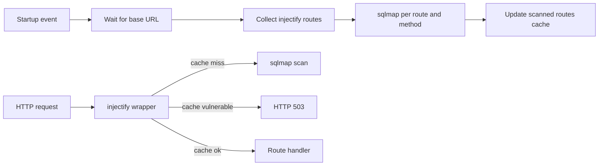

# Injectify — routes scanner for FastAPI

**Injectify** walks your FastAPI application’s route table, finds handlers protected with `@injectify`, and runs **sqlmap** against those URLs so SQL injection can be detected at startup and optionally enforced on each request.

## Prerequisites

- **sqlmap** available on your `PATH` (e.g. `pip install sqlmap`). The scanner resolves the executable via `shutil.which("sqlmap")`; if it is missing, scans fail at runtime.
- A **FastAPI** app and dependencies you already use in your project (see the `examples/` apps for database drivers).

## Quick start

```python
import os
from fastapi import FastAPI, Request

from injectify.core import injectify, register_injectify_controller

app = FastAPI()
PORT = int(os.environ.get("PORT", "8000"))

register_injectify_controller(app, port=PORT, host="localhost")


@injectify(db_type="PostgreSQL", scan_level=3)
async def example(request: Request, user_id: str):
    # Handler must receive `request` in kwargs — the decorator reads it.
    ...
```

1. Call **`register_injectify_controller(app, port=..., host=...)`** with the same host/port your server will listen on (for example `uvicorn main:app --host 0.0.0.0 --port 8000` → `port=8000`, and use `host` that is reachable from where sqlmap runs; often `localhost`).
2. Decorate routes with **`@injectify(...)`** only on handlers that include **`request: Request`** (passed by name in `kwargs`).

If you **do not** call `register_injectify_controller`, decorated handlers behave like normal route handlers (no scanning, no blocking).

## How the route scanner works

### Discovery

Injectify recursively traverses `app.routes` (including mounted sub-applications: path prefixes are concatenated). Every route whose endpoint is marked with `__injectify__` (set by the decorator) is collected, together with its HTTP methods and decorator options.

### Startup batch scan

On application **startup**, injectify:

1. Waits until `http://{host}:{port}` responds to **GET** (up to 30 seconds).
2. Collects all `@injectify` routes.
3. For each route and each method, runs **sqlmap** in a background task (thread pool). Path parameters in the route template (e.g. `/users/{id}`) are replaced with `1` when building the URL for sqlmap.
4. Updates an in-memory cache `_scanned_routes`: **safe** → allow traffic; **vulnerable** → later requests can be blocked; **scanning** → concurrent requests may proceed without waiting for sqlmap on that key.

Startup does **not** crash the app if a route is vulnerable: it logs a warning and records the result in the cache.

### Request-time behavior

When the controller is registered, each request hitting an `@injectify` handler goes through a wrapper that consults the cache:

- **Cache miss / first visit**: may launch sqlmap for that path and method, then update the cache.
- **`fail_on_vuln=True`** and injection reported on that scan path: raises **`InjectionDetectedError`**.
- **`fail_on_vuln=False`** and injection reported: raises **`HTTPException`** with status **503** (route still blocked from normal handling).
- **Cached vulnerable**: **503** without re-running sqlmap.
- **Cached safe**: handler runs as usual.

Parallel requests for the same route key while a scan is in progress use a per-route lock; behavior follows the `scanning` → allow path in the implementation so requests are not all serialized on sqlmap.



### Startup scan skips and failures

- If **`validate`** is enabled and **`params`** (or inferred params) fail validation, that route/method is **skipped** during the startup scan (warning in logs).
- If **sqlmap** raises an exception for a route, that route is treated as **ok** in the cache (`True`) so traffic is not permanently blocked.
- Non-zero sqlmap exit codes are logged; output is still interpreted for “vulnerable” / “injectable” substrings to set the cache.

## `@injectify` options

| Option | Purpose |
|--------|---------|
| `db_type` | Passed to sqlmap as `--dbms` when the value is in the supported list (e.g. `mysql`, `postgresql`, `microsoft sql server`). Invalid values log a warning and sqlmap uses auto-detection. |
| `params` | `dict` mapping parameter **names** to values (values are normalized to test payloads for sqlmap). **GET** / **HEAD**: adds a query string (`?k=test`). **POST** and others: uses `--data` and `--method`. If omitted, names are **inferred** from the handler signature (see below). |
| `scan_level` | Sqlmap `--level` (default `3`). |
| `sqlmap_extra` | Optional `list` of extra sqlmap CLI arguments (e.g. `["--risk=3"]`). |
| `validate` | If `True`, runs `validate_params` on the effective params dict before scanning. |
| `fail_on_vuln` | If `True`, **`InjectionDetectedError`** when injection is detected on the on-request scan path; if `False`, **`HTTPException(503)`** instead. |

## Parameter inference (`infer_params`)

Without an explicit `params` dict:

- **GET**: uses query-style parameters from the signature (everything that is not `Request` and not a Pydantic body model type).
- **POST / PUT / etc.**: uses field names from a **Pydantic `BaseModel`** body annotation if present; otherwise falls back to the same query-style list as GET.

If nothing can be inferred, the wrapper logs a warning and scanning for that path may be limited.

## Mounted routers

Routes registered on **mounted** `FastAPI` sub-apps are included: the collector walks nested `route.routes` and prefixes parent paths, so the full path sqlmap sees matches the public URL layout.

## Examples

Full demo APIs (intentionally vulnerable for testing sqlmap/injectify):

- [examples/postgresql](examples/postgresql)
- [examples/mysql](examples/mysql)
- [examples/mssql](examples/mssql)

Каждое демо поднимает **все** маршруты с `@injectify`: старые сценарии по HTTP-методам (`/users`, …) и отдельные **GET**-эндпоинты по типу инъекции под префиксом `/sqli/` (reflected/UNION с таблицей `secrets`, error-based, blind boolean, blind time, `ORDER BY`, `LIKE`, `HAVING`). Часть маршрутов задаёт `sqlmap_extra` с `--technique=…` для узкого прогона. При старте приложения **sqlmap вызывается отдельно для каждой пары (путь, метод)**, поэтому время запуска растёт с числом таких маршрутов. Список URL см. в ответе `GET /` у соответствующего примера.

## Security note

This tool is intended for **authorized** security testing and development. Only run sqlmap against systems you own or have explicit permission to test.
